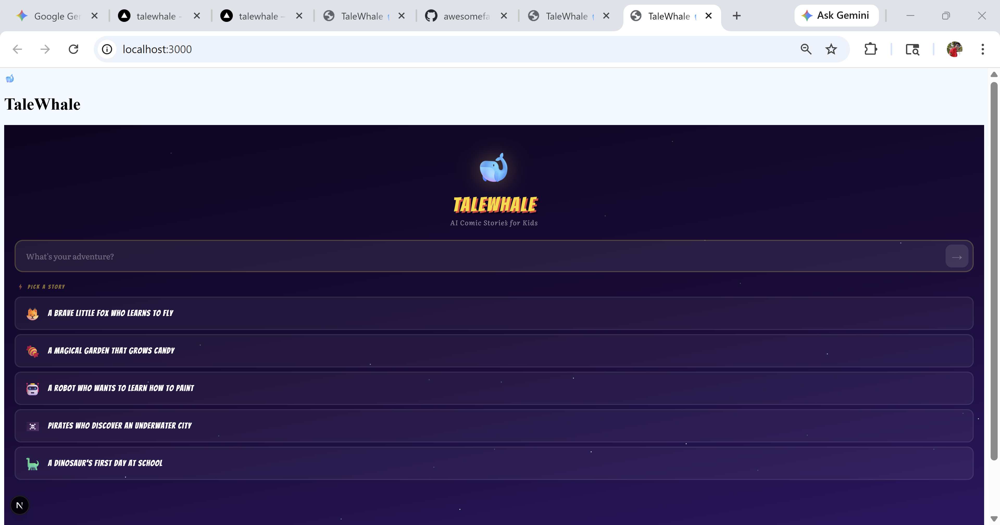

# 🐋 TaleWhale

**TaleWhale** is an AI-powered interactive comic book app for kids. Parents or kids can type a story idea and get a "choose-your-own-adventure" style comic book with panels, speech bubbles, and sound effects.

## 📸 Screenshot

## 🚀 Features

- **AI-Powered Storytelling**: Generates unique story chapters based on any prompt.
- **Interactive Comic Engine**: Dynamic layout with speech bubbles, narration, and SFX.
- **Visual Library**: Reusable SVG scene templates for consistent and fast rendering.
- **Model-Agnostic**: Works with Groq (default), OpenAI, Together AI, and more.
- **Mobile-First**: Responsive design for tablets and phones.

## 🛠️ Tech Stack

- **Frontend**: Next.js (App Router), Tailwind CSS
- **AI**: OpenAI-compatible LLM providers (Groq, OpenAI, etc.)
- **Icons**: Lucide React
- **Hosting**: Optimized for Vercel

## 🏁 Getting Started

### 1. Clone the repository
\`\`\`bash
git clone https://github.com/awesomefanda/talewhale.git
cd talewhale
\`\`\`

### 2. Install dependencies
\`\`\`bash
npm install
\`\`\`

### 3. Set up environment variables
Create a \`.env.local\` file in the root:
\`\`\`env
LLM_PROVIDER=groq
LLM_API_KEY=your_api_key_here
\`\`\`

### 4. Run the development server
\`\`\`bash
npm run dev
\`\`\`

Open [http://localhost:3000](http://localhost:3000) with your browser to see the result.

## 📄 License

This project is licensed under the MIT License - see the [LICENSE](LICENSE) file for details.
